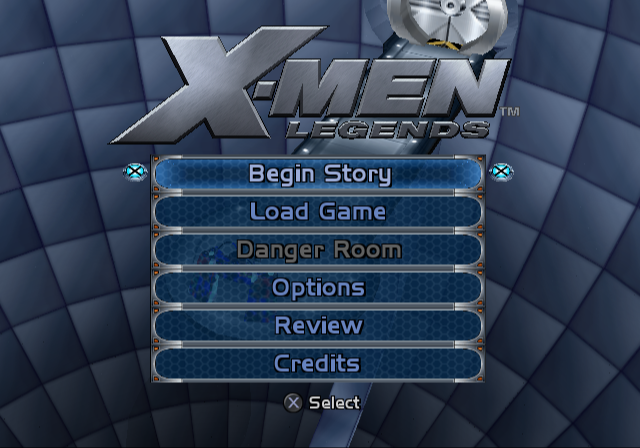
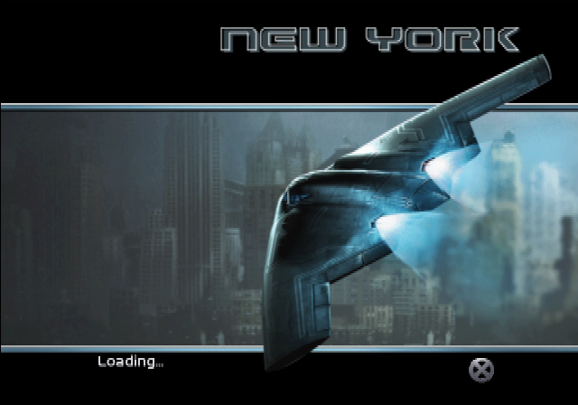
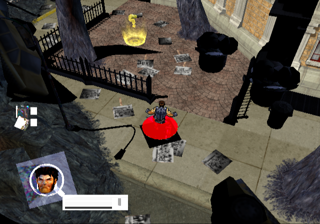

# X-Men Legends PS2Recomp Bring-up

An experimental static recompilation of the North American PlayStation 2 release of **X-Men Legends** (`SLUS_206.56`) for PC, built with [PS2Recomp](https://github.com/ran-j/PS2Recomp).

> [!IMPORTANT]
> This is active bring-up work, not a playable release. A legal disc dump is required, generated code is not distributed, and normal retail startup does not yet complete the Sofdec sequence or reach gameplay without development overrides.

## Acceptance Target

The project goal is a native PC build that follows the unmodified retail boot flow through the legal screen, all startup movies with audio, the fully rendered 3D Cerebro title scene, and playable campaign gameplay without graphical or audio defects.

| Milestone | Current state |
| --- | --- |
| Legal and memory-card flow | Renders and advances; final presentation/timing validation remains |
| Startup Sofdec movies | File I/O, demux, MPEG/IPU submission, and ADX transport run; decoded video and audible movie playback remain broken |
| 3D title scene | Complete title UI and Cerebro chamber render after a reversible movie bypass |
| First campaign level | The real Begin Story path loads and renders New York; lighting, effects, blending, and HUD remain defective |
| Playable release | Not yet |

## Current Status

The game now executes far beyond initial boot and has reached each of these milestones in the native PC runtime:

- Legal text and memory-card screens that render and advance.
- Complete title UI and the 3D Cerebro chamber after a reversible startup-movie bypass.
- ZAUDIO stream creation, buffering, and playback service calls.
- First-level loading and world rendering through the real **Begin Story** menu path after a reversible startup-movie bypass.
- Retail SFD file I/O, PSS demux, MPEG/IPU submission, and ADX block transport.

The title level reaches a clean, complete Cerebro scene using the game's own GIF transfers; coalescing duplicate pending DMAC completion events fixed the skipped texture upload that previously required a diagnostic repair. The real New Game handler now transitions deterministically from the initialized title level into the first campaign level, and the current clean build renders the complete New York world through VU/GIF/GS. The earlier apparent world-rendering regression was an invalid comparison against the direct `loadMap()` shortcut, which skips campaign initialization and produces only HUD fragments.

The highest-priority gameplay blockers are now split into two testable paths using `igb-blender` as the authored-format reference. Of 201 map texture bindings, 200 are one-byte PSMT8 indices with 256-entry RGBA CLUTs. Static map geometry carries baked vertex colors and explicitly disables live lighting, matching Alchemy's fixed-function `texture * vertex color * 2` path. The affected black props instead have normals, no baked colors, and inherit live lighting. Runtime tracing observed 79 of 81 unique New York textures; every observed index payload and every CSM1 palette upload matches the plugin data exactly after the game's 0-255 to 0-128 GS alpha conversion. The two unobserved entries are an unpalettized shadow texture and an unused subway texture. All 12 authored lights also arrive with their exact colors and apply enabled before scene traversal restores them. The previously observed zero at `0x752750` is the separate global scene-ambient multiplier, not proof that those live lights were lost. Current tracing therefore follows the active lights into material and VU packets, after IGB extraction, deserialization, and host-to-GS upload have been ruled out.

The separate retail-startup blocker remains correct Sofdec output. The demux advances through each movie and its ADX audio header and blocks arrive intact, but visible decoded frames and audible movie playback are not yet correct. The full acceptance target remains unfinished.

## Bring-up Screenshots

These are direct runtime framebuffer captures, not emulator or desktop captures. They document milestones rather than release quality.

| Title UI | New York loading screen |
| --- | --- |
|  |  |
| The complete title UI and textured 3D Cerebro chamber render naturally after bypassing the unfinished startup movies. No game-specific title-texture repair is active. | The first-level loading artwork and text render from the retail game data. |

### First Gameplay Frame



This current-build frame comes from the real Begin Story campaign flow and renders the environment, Wolverine, props, effects, and HUD. Unlit black props, missing foliage, and incomplete HUD colors remain visible, so this is a major bring-up milestone rather than release-quality gameplay.

## Repository Layout

| Path | Purpose |
| --- | --- |
| `xmen-legends/xmen-legends.boot.final3.toml` | Current stripped-ELF recompiler configuration |
| `xmen-legends/xmen-legends.synthetic-ghidra.final3.csv` | Repaired function map used by the recompiler |
| `xmen-legends/xmen-legends.resume-entry-points.observed.txt` | Validated internal callable entry points |
| `xmen-legends/dev-overrides/` | Reversible startup and gameplay diagnostic scripts |
| `xmen-legends/apply-generated-first-level-probe.ps1` | Reapplies the deterministic native New Game probe after regeneration |
| `xmen-legends/run-guarded-probe.ps1` | Bounded runtime probe and artifact retention |
| `xmen-legends/cleanup-generated-artifacts.ps1` | Removal of obsolete builds, captures, and logs |
| `xmen-legends/inspect-igb-scene.py` | Reports authored geometry, PSMT8/CLUT, material, and light state through `igb-blender` |

The PS2Recomp checkout, extracted disc, ELF, generated C++, build products, memory cards, and probe captures are deliberately ignored. They are local inputs or reproducible artifacts, not redistributable project source.

## Requirements

- Windows 10 or 11
- CMake 3.20 or newer
- Visual Studio 2022 with the Desktop development with C++ workload
- A CPU with the SIMD support required by PS2Recomp
- A legally obtained North American X-Men Legends PS2 disc image

## Development Setup

Clone this workspace and the project fork beside its tracked configuration:

```powershell
git clone https://github.com/GTTeancum/OpenXML1.git
Set-Location OpenXML1
git clone --recurse-submodules https://github.com/GTTeancum/PS2Recomp.git PS2Recomp
git -C PS2Recomp checkout codex/xmen-legends-bringup
```

Extract your own disc into `xmen-legends/disc/` and place the game ELF at `xmen-legends/SLUS_206.56`. The repository does not contain or download copyrighted game data. If the workspace is not at `C:\Programming\GitHub\OpenXML1`, update the absolute paths in `xmen-legends/xmen-legends.boot.final3.toml` before recompiling.

Configure and build the recompiler:

```powershell
cmake -S PS2Recomp -B PS2Recomp/out/xmen-final3-build
powershell -ExecutionPolicy Bypass -File xmen-legends/build-below-normal.ps1 `
  -Target ps2_recomp
```

Generate the game C++ and configure the runtime against it:

```powershell
& PS2Recomp/out/xmen-final3-build/ps2xRecomp/Release/ps2_recomp.exe `
  xmen-legends/xmen-legends.boot.final3.toml

powershell -ExecutionPolicy Bypass -File `
  xmen-legends/apply-generated-first-level-probe.ps1

cmake -S PS2Recomp -B PS2Recomp/out/xmen-final3-build `
  -DPS2X_RECOMPILED_OUTPUT_DIR="$PWD/xmen-legends/output_mapped_final3" `
  -DPS2X_DEFAULT_BOOT_ELF="$PWD/xmen-legends/disc/SLUS_206.56"

powershell -ExecutionPolicy Bypass -File xmen-legends/build-below-normal.ps1 `
  -Target ps2EntryRunner
```

Run from the extracted disc directory so the original relative asset paths resolve:

```powershell
Push-Location xmen-legends/disc
& ../../PS2Recomp/out/xmen-final3-build/ps2xRuntime/Release/ps2EntryRunner.exe `
  ./SLUS_206.56
Pop-Location
```

The development scripts assume this layout. Compiler, recompiler, CMake, and MSBuild work runs at Below Normal priority with one compiler worker. `run-guarded-probe.ps1` keeps the visible, user-closable runtime at Normal priority, limits it to four logical processors, and bounds retained logs and captures so repeated investigation does not monopolize the host or grow the workspace indefinitely.

## Controls

The first available gamepad is mapped as a PS2 controller. Keyboard mappings are also available:

| PS2 input | Keyboard |
| --- | --- |
| Left analog | `W` `A` `S` `D` |
| D-pad | Arrow keys |
| Square / Cross / Circle / Triangle | `Z` / `X` / `C` / `V` |
| L1 / R1 | `Q` / `E` |
| L2 / R2 | `1` / `3` |
| Start / Select | `Enter` / `Right Shift` |
| L3 / R3 | `Left Ctrl` / `Right Ctrl` |

Input is implemented, but the complete retail flow is not yet ready for normal play testing.

## Known Issues

- Sofdec SFD file reads and demux advance, but startup movies do not yet produce correct presented video frames.
- The ADX header and compressed blocks traverse the movie audio ring correctly; audible SFD playback is not yet verified end to end.
- Gameplay is reachable through the real New Game handler after bypassing startup movies. The complete world renders on the current clean build, while the direct `loadMap()` shortcut remains intentionally unsuitable because it skips campaign setup. HUD, material-lighting, effect, and blending defects remain.
- Performance is diagnostic-build quality; timing and resource use have not been optimized for release.
- The current TOML contains workspace-specific absolute paths.

## Roadmap

1. Trace the verified authored live lights and byte-exact PSMT8/CLUT uploads through material, VU, and GS sampling state, repair the first divergence, and reduce any general runtime defect to a reusable PS2Recomp fix.
2. Repair gameplay material lighting, effects, blending, and HUD rendering, then validate normal controller input and game audio.
3. Complete Sofdec video decode/presentation and movie audio playback on the retail startup path.
4. Validate the complete legal-to-title-to-campaign flow without development overrides and package a reproducible PC build process.

## Contributing

Reproduction notes, focused PS2 hardware tests, and generally useful PS2Recomp fixes are welcome. Keep copyrighted game files, extracted assets, generated game code, build products, and probe logs out of commits. Generic runtime changes should include a focused test and be submitted separately to upstream PS2Recomp; game-specific maps, scripts, and diagnostics belong in this repository until their behavior is understood well enough to generalize.

Use `xmen-legends/run-guarded-probe.ps1` for bounded runtime tests and `xmen-legends/cleanup-generated-artifacts.ps1` after investigation. Runtime probes remain at Normal priority and are user-closable; build tools run at Below Normal priority. The scripts constrain CPU affinity and retain only explicitly pinned evidence.

## Upstream Work

Runtime and recompiler changes are developed in the public [GTTeancum/PS2Recomp fork](https://github.com/GTTeancum/PS2Recomp). General fixes are split into focused submissions to upstream PS2Recomp:

- [#217: Fix synthetic SIF RPC server memory aliasing](https://github.com/ran-j/PS2Recomp/pull/217)
- [#218: Fix R5900 SQRT.S source register](https://github.com/ran-j/PS2Recomp/pull/218)
- [#219: Fix VU0 VCLIP semantics](https://github.com/ran-j/PS2Recomp/pull/219)
- [#222: Defer EE time-slice preemption while interrupts are disabled](https://github.com/ran-j/PS2Recomp/pull/222)
- [#223: Complete zero-QWC terminal DMA chains](https://github.com/ran-j/PS2Recomp/pull/223)
- [#224: Honor DMAC scratchpad address selectors](https://github.com/ran-j/PS2Recomp/pull/224)
- [#225: Support configurable callable entry points](https://github.com/ran-j/PS2Recomp/pull/225)
- [#226: Delay and coalesce GIF DMA completion interrupts](https://github.com/ran-j/PS2Recomp/pull/226)
- [#227: Preserve framebuffer rows in interlaced presentation](https://github.com/ran-j/PS2Recomp/pull/227)
- [#228: Support profile-defined SJRMT UNI storage](https://github.com/ran-j/PS2Recomp/pull/228)
- [#229: Support GIF IMAGE2 transfers](https://github.com/ran-j/PS2Recomp/pull/229)
- [#230: Honor GS COLCLAMP during alpha blending](https://github.com/ran-j/PS2Recomp/pull/230)
- [#231: Correct TEXCLUT addressing for CSM1 and CSM2](https://github.com/ran-j/PS2Recomp/pull/231)
- [#232: Expand VIF UNPACK V4-5 channels](https://github.com/ran-j/PS2Recomp/pull/232)
- [#237: Expand VIF UNPACK V2 and V3 lanes](https://github.com/ran-j/PS2Recomp/pull/237)

All fifteen submissions are open as of August 30, 2026. Game-specific diagnostics and unfinished compatibility work remain on `codex/xmen-legends-bringup` until they can be reduced to reusable changes with focused tests.

## Legal

This project contains no game ISO, executable, extracted assets, or generated copyrighted game code. X-Men and X-Men Legends are properties of their respective owners. You must supply your own legally obtained game data.
